# CRM

스마트스토어 주문 엑셀을 업로드하면 고객/주문 관리가 자동화되는 CRM. Next.js(App Router) + TypeScript +
TailwindCSS + shadcn/ui + Supabase.

> **핵심 설계 원칙**: 고객의 식별자는 전화번호가 아니라 `customer_id`(및 사람이 읽는 `customer_code`,
> 예: `C000001`)입니다. 전화번호/주소가 바뀌어도 `customer_code`는 변하지 않습니다. 동일인으로 의심되는
> 두 고객은 **절대 자동으로 병합되지 않으며**, 관리자가 [동일인 검토] 화면에서 직접 승인해야 병합됩니다.

## 기술 스택

- Next.js 16 (App Router, Turbopack, Server Actions) — Next 16에서 `middleware.ts`가 `proxy.ts`로
  이름이 바뀌었습니다. 이 저장소는 `src/proxy.ts`를 사용합니다.
- TypeScript, TailwindCSS v4, shadcn/ui (Radix 기반)
- Supabase (Postgres) — 서버에서 서비스 롤 키로만 접근 (아래 "인증/보안 설계" 참고)
- xlsx(SheetJS)로 엑셀/CSV 파싱, react-dropzone으로 드래그앤드롭 업로드

## Sprint 진행 상황

- **Sprint 1** (완료): 프로젝트 스캐폴딩, 공통 레이아웃(Sidebar/Header), 임시 관리자 로그인(admin/1234),
  라우트 보호(proxy), Supabase 연결 구조, Vercel 배포 가능한 상태.
- **Sprint 2** (완료): 엑셀 업로드 → 컬럼 자동 매핑 → 주문/주문상품/고객 생성 → 동일인 후보 탐지 →
  결과 리포트, Import 이력, 동일인 검토/병합 화면, 고객관리(검색/상세/변경이력), 주문관리.
- **Sprint 3** (일부 완료): Dashboard 심화 통계(매출 추이 차트, 신규 vs 재구매), VIP 세그먼트, 재주문 분석
  완료. 문자 발송은 외부 연동이 필요해 보류 중.
- **Sprint 4** (완료): Dashboard 전면 재구축 — KPI 카드(객단가/평균 재주문 주기 포함), 최근 주문/업로드,
  동일인 검토 카드, 월별 매출·요일별 주문 차트(Recharts), 인기상품 TOP10, 고객 구매 랭킹, 최근 미주문
  고객. 모든 집계를 Supabase View/RPC로 이동해 원시 행을 앱으로 끌어와 합산하지 않도록 함.
- **Sprint 5** (완료): 고객 CRM 기능 강화 — 즐겨찾기 토글, 고객 상태(정상/휴면/주의/차단), VIP 자동 분류
  뱃지를 고객 상세/목록에 노출. 주문·전화번호/주소 변경·병합·메모 변경을 하나로 합친 Timeline 추가.
  기존 변경 이력/병합 이력은 그대로 유지.
- **Sprint 6** (완료): 엑셀 업로드 시 전체화면 로딩 오버레이로 중복 등록 방지, 업로드 이력 삭제(주문+연관
  고객 정리) 기능, 주문관리 필터/정렬 및 배송일·구매자·상품명·수량·연락처·배송지주소·배송메세지·
  가방번호·회수여부 컬럼 노출, 옵션정보에서 배송일 자동 파싱, 가방 회수 일괄 처리 버튼, 수동 주문 등록,
  포인트 컬러를 반영한 디자인 리프레시.
- **Sprint 7** (완료): 주문 관리 시스템 → 배송 운영 시스템으로 확장. (1) 주문관리 정렬/필터 재구성,
  가방 회수를 주문 상세의 "이전 미회수 알림" 방식으로 전환. (2) 동일인 병합 시 고객을 삭제하지 않고
  `status=merged`로 표시(감사 이력 보존) + 완전 일치 중복 재검사. (3) 배송기사 로그인 역할, 기사관리,
  배송관리(배송일별 기사 배정), 기사 전용 배송완료 화면. (4) 정산관리(기사별 배송건수×단가, 일/주/월별,
  지급상태 수동 처리). 자세한 내용은 아래 "주문/배송/기사/정산 확장 (Sprint 7)" 참고.
- **Sprint 7 버그 수정** (완료): 주문관리/배송관리 배송지주소 컬럼 정렬 추가, 상태 컬럼에서 스마트스토어
  원본 상태 텍스트 중복 표시 제거, 수동 주문 등록 다이얼로그의 배송일 입력이 저장되지 않던 id 충돌 버그
  수정, 잘못된 날짜 쿼리 파라미터 방어, 다음(카카오) 우편번호 서비스 연동으로 주소 표준 입력(수동 주문
  등록/고객 정보 수정 화면).
- **Release QA** (완료): Import 5개 케이스(신규 생성/기존 고객 재사용/주소 변경/전화번호 변경/주문번호 중복
  스킵), 배송/기사/정산 전체 흐름, 권한 분리(관리자/일반/기사)를 실제 프로덕션 데이터로 검증. QA 중 발견된
  수동 주문 수정/삭제 기능 부재를 확인해 추가함(주문 상세 화면에서 `order_source='manual'`인 주문만 수정/
  삭제 가능 — 엑셀로 들어온 원본 주문은 스냅샷이라 수정 대상이 아님).

## 시작하기

### 1. 의존성 설치

```bash
npm install
```

### 2. Supabase 프로젝트 준비

1. [supabase.com](https://supabase.com)에서 새 프로젝트를 만듭니다.
2. Supabase SQL Editor에서 [`supabase/schema.sql`](supabase/schema.sql)을 실행합니다.
3. (선택) 로컬 테스트용 샘플 데이터가 필요하면 [`supabase/seed.sql`](supabase/seed.sql)도 실행합니다.
4. Project Settings → API에서 **Project URL**과 **service_role key**를 복사합니다.

### 3. 환경 변수 설정

`.env.example`을 `.env.local`로 복사하고 값을 채웁니다.

```bash
cp .env.example .env.local
```

```env
AUTH_SECRET=       # node -e "console.log(require('crypto').randomBytes(32).toString('hex'))"
ADMIN_USERNAME=admin
ADMIN_PASSWORD=1234
SUPABASE_URL=
SUPABASE_SERVICE_ROLE_KEY=
```

### 4. 개발 서버 실행

```bash
npm run dev
```

[http://localhost:3000](http://localhost:3000) 접속 후 `admin` / `1234`로 로그인합니다.

## 인증/보안 설계

- Sprint 1 요구사항에 따라 Supabase Auth 대신 **임시 하드코딩 계정**(`src/lib/auth/credentials.ts`의
  `ACCOUNTS` 배열, 비밀번호는 환경 변수로 오버라이드 가능)을 사용합니다. 로그인에 성공하면 서버에서
  `{username, role}`을 담은 HMAC 서명 세션 쿠키를 발급합니다 (`session.ts`, `current-session.ts`).
- `src/proxy.ts`(Next.js 16의 `middleware` 후속 규약)가 모든 요청에서 세션 쿠키를 검증해 `/login`을 제외한
  모든 경로를 보호합니다.
- Supabase 쪽은 모든 테이블에 RLS를 켜두었지만 anon/authenticated 정책은 두지 않았습니다. 서버(Server
  Actions/컴포넌트)는 **서비스 롤 키**로만 접근하므로(`src/lib/supabase/admin.ts`) RLS를 우회하지만, 그
  키는 절대 클라이언트로 노출되지 않습니다.
- **향후 Supabase Auth로 전환**하려면 `src/lib/auth/credentials.ts` + `session.ts` 자리에 Supabase Auth
  세션 확인 로직을 넣고, `proxy.ts`와 각 페이지의 `requireSession()` 호출부는 그대로 두면 됩니다. 인증
  로직이 한 곳에 모여 있도록 의도적으로 분리해뒀습니다.

### 계정 및 데이터 범위 (다중 사용자)

- 계정: `admin`(관리자) / `user1`~`user5`(담당자). 비밀번호는 `app_accounts` 테이블에 scrypt로 해시
  저장되며, 처음 로그인 시 환경 변수(`ADMIN_PASSWORD`, `USER1_PASSWORD` … `USER5_PASSWORD`, 기본값
  `1234`)로 자동 시딩됩니다. 이후 비밀번호 변경은 [설정] 화면에서 처리하며(담당자는 본인 것만, 관리자는
  아무 계정이나), 환경 변수는 더 이상 참조되지 않습니다.
- `customers`/`orders`/`imports`/`duplicate_candidates`에 `owner_username` 컬럼이 있습니다. 담당자
  계정은 본인이 업로드/등록한 데이터만 조회·수정·병합할 수 있고, `admin`은 전체를 조회할 수 있습니다
  (`src/lib/auth/current-session.ts`의 `ownerScopeFor()` — `admin`이면 `undefined`를 반환해 필터를
  걸지 않습니다).
- 동일인 탐지도 계정별 고객 풀 내에서만 이뤄집니다(다른 담당자의 고객과는 비교하지 않음). 병합/보류/
  거부도 본인 소유 후보이거나 `admin`일 때만 허용됩니다 (`merge.service.ts`의 `assertCanActOn`).
- 이미 스키마를 적용한 Supabase 프로젝트가 있다면
  [`supabase/migrations/0002_add_owner_username.sql`](supabase/migrations/0002_add_owner_username.sql)을
  SQL Editor에서 실행해 컬럼을 추가하세요 (기존 행은 모두 `owner_username = 'admin'`으로 채워집니다).

### VIP / 재주문 분석 (Sprint 3)

- **VIP 고객**: `customer_order_stats` 뷰(고객별 주문횟수/총액 집계)를 기준으로, 총 구매금액 또는
  주문횟수 둘 중 하나만 넘어도 VIP로 분류합니다. 기준값은 `app_settings` 테이블에 저장되며 [설정] 화면
  (관리자 전용)에서 즉시 변경할 수 있습니다 — 기본값은 50만원 또는 10회.
- **재주문 임박**: 전역 고정값이 아니라 **고객 개인의 과거 평균 주문 주기**를 계산해, 그 주기를 이미
  넘겼는데 재주문이 없는 고객만 보여줍니다(`reorder.service.ts`). 주문이 1건뿐인 고객은 주기를 계산할
  수 없어 대상에서 제외됩니다.
- 두 기능 모두 계정별 데이터 범위(`owner_username`)를 그대로 따릅니다.
- 이미 스키마를 적용한 프로젝트는
  [`supabase/migrations/0005_stats_and_settings.sql`](supabase/migrations/0005_stats_and_settings.sql)을
  SQL Editor에서 실행하세요.

### Dashboard 분석 (Sprint 4)

- `customer_order_gaps`/`customer_reorder_cycle` 뷰(윈도우 함수로 주문 간 간격 계산), `monthly_revenue`
  / `orders_by_weekday` / `top_products` / `order_amount_summary` RPC 함수를 새로 추가했습니다. 원시
  주문 행을 앱으로 가져와 JS에서 합산하지 않고, 집계 자체를 Postgres에서 끝내는 방식입니다
  (`dashboard-analytics.repository.ts`).
- 이미 스키마를 적용한 프로젝트는
  [`supabase/migrations/0006_dashboard_analytics.sql`](supabase/migrations/0006_dashboard_analytics.sql)을
  SQL Editor에서 실행하세요.

### 고객 CRM 강화 (Sprint 5)

- `customers` 테이블에 `is_favorite`(즐겨찾기), `status`(고객 상태: `active`/`dormant`/`watchlist`/`blocked`)
  컬럼을 추가했습니다. VIP는 여전히 주문 통계 기반 자동 분류(`vip.service.ts`)이며, `status`는 담당자가
  직접 지정하는 별도 필드입니다.
- **Timeline**: 주문, 전화번호/주소 변경, 병합, 메모 변경을 하나의 시간순 피드로 합쳐서 보여줍니다
  (`timeline.service.ts`). 기존의 변경 이력 표(`customer_change_logs` 기반)와 병합 이력은 그대로
  유지되며, Timeline은 이를 대체하지 않고 보완합니다.
- 이미 스키마를 적용한 프로젝트는
  [`supabase/migrations/0007_customer_favorite_status.sql`](supabase/migrations/0007_customer_favorite_status.sql)을
  SQL Editor에서 실행하세요.

### 주문 운영 개선 (Sprint 6)

- `orders` 테이블에 `delivery_date`(배송일), `bag_number`(가방번호), `bag_returned`(회수여부),
  `order_source`(`import`/`manual`) 컬럼을, `customers` 테이블에 `created_by_import_id`(어느 import가
  이 고객을 새로 만들었는지)를 추가했습니다.
- **엑셀 업로드 안전장치**: 업로드 진행 중에는 전체화면 로딩 오버레이로 다른 조작(중복 클릭 포함)을
  막고, 새로고침/이탈 시 경고합니다. 실수로 중복 등록했을 경우 Import 이력에서 삭제 버튼으로 해당
  업로드의 주문을 모두 지우고, 그 업로드가 새로 만든 뒤 주문이 0건이 된 고객도 함께 정리합니다
  (`import.service.ts`의 `deleteImport`).
- **배송일 자동 인식**: 스마트스토어 옵션정보 컬럼에 담긴 "MM월DD일" 형식의 배송 날짜를 정규식으로
  추출해 `delivery_date`로 저장합니다(`delivery-date.ts`).
- **가방 회수 관리**: 주문관리 화면에서 가방번호/회수여부를 인라인으로 바로 수정할 수 있습니다. (Sprint 7에서
  상단 일괄 처리 버튼은 제거되고, 주문 상세의 "이전 미회수 알림" 방식으로 대체되었습니다 — 아래 참고.)
- **주문 필터/정렬 + 수동 주문**: 배송일 범위·상태·회수여부로 필터링하고 배송일/주문일/금액 기준으로
  정렬할 수 있습니다. "수동 주문 등록"은 엑셀 업로드와 동일한 고객 매칭 로직을 재사용해 고객관리에도
  바로 반영됩니다.
- 이미 스키마를 적용한 프로젝트는
  [`supabase/migrations/0008_delivery_bag_manual_order.sql`](supabase/migrations/0008_delivery_bag_manual_order.sql)을
  SQL Editor에서 실행하세요.

### 주문/배송/기사/정산 확장 (Sprint 7)

기존 "주문관리 → 고객관리 → Dashboard" 구조를
"주문관리 → 배송관리 → 기사관리 → 정산관리 → 고객관리"로 확장했습니다.

- **주문관리 개편**: 모든 컬럼(주문번호/주문일/배송일/구매자/연락처/금액/상태/담당기사)을 헤더 클릭으로
  정렬할 수 있습니다. 필터는 주문일 범위 + 배송일(단일) + 상태(배송대기/배송중/완료) + 가방 미회수
  체크박스로 재구성했습니다. 내부 배송 진행 상태(`delivery_status`)는 스마트스토어 원본 `status`
  텍스트와 별개로 관리되며, 기사 배정/배송완료 처리에 따라 자동 전이됩니다.
- **가방 회수 알림 흐름**: 주문 상세 화면에서 가방 회수 완료를 체크하면, 같은 고객의 이전 미회수 주문을
  자동으로 찾아 "전체 회수 / 현재 주문만 / 취소" 확인창을 띄웁니다.
- **동일인 병합 정책 변경**: 병합 시 고객을 더 이상 삭제하지 않습니다 — `status='merged'` +
  `merged_into_id`로 표시해 이력을 보존하고, 고객 목록/검색에서는 자동으로 숨깁니다(상세 페이지 진입 시
  안내 배너 표시). 이름+전화번호+주소가 완전히 동일한 중복 고객을 "동일인 검토" 화면 진입 시마다
  재검사해서 자동으로 후보로 올립니다(실시간 업로드 시점 탐지가 놓친 경우 보완).
- **배송기사 시스템**: `app_accounts.role`에 `driver`가 추가되었습니다. 기사 계정은 `/login`으로 로그인하되
  `/driver`(내 배송) 화면 외에는 접근할 수 없고, 사이드바에도 다른 메뉴가 노출되지 않습니다
  (`src/proxy.ts`에서 역할 기반으로 강제 리다이렉트).
- **기사관리** (설정 화면, 관리자 전용): 기사 등록 시 로그인 계정을 함께 생성합니다. 건당 배송비를
  기사별로 다르게 설정할 수 있고, 삭제 대신 활성/비활성 처리합니다.
- **배송관리** (신규 메뉴): 배송일을 선택하면 그날 배송 예정인 주문을 조회하고, 여러 건을 선택해 담당
  기사를 한 번에 배정합니다(배정 시 `배송대기 → 배송중`). 기사는 본인의 "내 배송" 화면에서 배정된
  주문만 보고 배송완료 처리합니다(`배송중 → 완료`, `completed_at` 기록).
- **정산관리** (신규 메뉴): 일별/주별/월별로 기간을 선택하면 기사별 배송완료 건수 × 건당 단가를 계산해
  보여줍니다. 지급 여부는 관리자가 수동으로 지급완료/취소 처리합니다.
- **수동 주문 order_number nullable**: 스마트스토어 주문만 주문번호가 필수이고, 수동 주문은 없어도
  됩니다(가짜 주문번호를 만들어 채우지 않습니다).
- **옵션정보 배송지역 파싱**: 배송일과 함께 배송 가능 지역 설명도 `delivery_area`로 저장합니다.
- **고객관리 정렬 + 평소 가방번호**: 고객번호/이름/전화번호/주소/주문횟수/총금액/최근주문일을 헤더
  클릭으로 정렬할 수 있습니다(`customer_list_view`). 고객 상세에서 "평소 가방번호"를 수정할 수 있고,
  엑셀에 가방번호 컬럼이 있으면 최초 등록 시 자동으로 채워집니다(기존 값은 덮어쓰지 않음).
- 이미 스키마를 적용한 프로젝트는 아래 마이그레이션을 순서대로 SQL Editor에서 실행하세요:
  [`0009_delivery_driver_settlement.sql`](supabase/migrations/0009_delivery_driver_settlement.sql),
  [`0010_exact_duplicate_match_type.sql`](supabase/migrations/0010_exact_duplicate_match_type.sql),
  [`0011_customer_list_view.sql`](supabase/migrations/0011_customer_list_view.sql),
  [`0012_settlements.sql`](supabase/migrations/0012_settlements.sql).

## 폴더 구조

```
src/
  app/
    (auth)/login/            로그인 페이지
    (protected)/             인증이 필요한 모든 화면 (layout.tsx가 Sidebar/Header 제공)
      page.tsx                 Dashboard
      orders/                   주문관리
      customers/                고객관리 (목록 + [id] 상세)
      import/                   엑셀 업로드
      duplicates/               동일인 검토
      delivery/                 배송관리 (관리자/담당자용 배송일별 기사 배정 보드)
      driver/                   내 배송 (기사 전용, role=driver만 접근)
      settlements/              정산관리 (기사별 배송건수×단가)
      stats/, settings/         통계 / 설정 (기사관리 포함)
      error.tsx, loading.tsx    공통 에러/로딩 UI
    proxy.ts                  Next 16 라우트 보호 (구 middleware.ts) + driver 역할 라우트 강제
  actions/                  'use server' 진입점 (얇게 유지, 검증 후 서비스 계층 호출)
  components/
    ui/                       shadcn/ui 프리미티브
    layout/, auth/, import/, duplicates/, customers/, orders/, delivery/, settlements/, settings/, common/
  lib/
    auth/                     세션 발급/검증 (Supabase Auth로 교체 가능하도록 분리)
    supabase/                 서비스 롤 클라이언트
    repositories/             Supabase 쿼리 전담 (비즈니스 로직 없음)
    services/                 비즈니스 로직 (엑셀 파싱, 컬럼 매핑, 동일인 탐지, 병합, 대시보드 등)
    utils/                    전화번호/주소 정규화, 문자열 유사도
    constants/
  types/                    domain(도메인 타입), excel(업로드 파이프라인), database(Supabase 스키마 타입)
supabase/
  schema.sql                DB 스키마 (customers/orders/order_items/imports/duplicate_candidates/merge_history/customer_change_logs)
  seed.sql                  샘플 데이터
```

계층 규칙: **페이지/컴포넌트 → actions(`'use server'`) → services(비즈니스 로직) → repositories(Supabase
쿼리)**. 반대 방향 의존은 없습니다.

## ERD

```mermaid
erDiagram
  customers ||--o{ orders : "places"
  orders ||--o{ order_items : "contains"
  imports ||--o{ orders : "creates"
  customers ||--o{ duplicate_candidates : "existing_customer_id"
  customers ||--o{ duplicate_candidates : "new_customer_id"
  duplicate_candidates ||--o| merge_history : "resolved into"
  customers ||--o{ merge_history : "kept_customer_id"
  customers ||--o{ customer_change_logs : "history"

  customers {
    uuid id PK
    text customer_code UK "C000001 형식, 불변"
    text name
    text phone "010-1234-1234 정규화"
    text address
    text address_normalized "비교 전용"
    text memo
    text[] tags
  }

  orders {
    uuid id PK
    uuid customer_id FK
    text order_number UK
    timestamptz order_date
    text status
    numeric total_amount
    text recipient_name "주문 당시 스냅샷"
    text phone_snapshot "주문 당시 스냅샷"
    text address_snapshot "주문 당시 스냅샷"
    text delivery_memo
    uuid import_id FK
  }

  order_items {
    uuid id PK
    uuid order_id FK
    text product_name
    text option_name
    int quantity
    numeric unit_price
    numeric amount
  }

  imports {
    uuid id PK
    text file_name
    text status
    int total_rows
    int success_rows
    int failed_rows
    int new_customers
    int existing_customers
    int duplicate_candidates
    jsonb column_mapping
    jsonb error_log
  }

  duplicate_candidates {
    uuid id PK
    uuid existing_customer_id FK
    uuid new_customer_id FK
    text match_type "phone_changed 등 CASE1-5"
    text confidence "HIGH/MEDIUM"
    text reason
    text status "pending/merged/rejected/held"
  }

  merge_history {
    uuid id PK
    uuid duplicate_candidate_id FK
    uuid kept_customer_id FK
    uuid removed_customer_id "FK 없음: 삭제된 고객"
    int orders_moved
    text performed_by
  }

  customer_change_logs {
    uuid id PK
    uuid customer_id FK
    text entity "customer_phone/address/merge/info"
    text field
    text old_value
    text new_value
    text performed_by
  }
```



## 엑셀 업로드 파이프라인 (Sprint 2 핵심)

`src/lib/services/import.service.ts`가 오케스트레이션을 담당합니다.

1. **파싱** (`excel-parser.service.ts`): xlsx/xls/csv를 첫 시트 기준으로 헤더+행 배열로 변환.
2. **컬럼 자동 매핑** (`column-mapping.service.ts`): "주문번호(ID)", "OrderNo" 등 스마트스토어가 컬럼명을
   바꿔도 별칭 사전으로 인식. 필수 항목이 자동 인식되지 않으면 업로드 화면에서 관리자가 직접 선택합니다.
3. **주문 생성**: 같은 `order_number`를 가진 행들을 한 주문으로 묶고(상품 라인별로 여러 행), 주문
   원본의 전화번호/주소/수령인/배송메모를 **스냅샷**으로 저장합니다.
4. **고객 생성/매칭** (`customer.service.ts`): 이름+전화번호+정규화된 주소가 **모두** 일치할 때만 같은
   고객으로 간주합니다. 하나라도 다르면 새 고객을 만들고 동일인 탐지로 넘깁니다.
5. **동일인 후보 탐지** (`duplicate-detection.service.ts`): CASE1~5 규칙(아래 참고)에 따라 후보를
   생성합니다. **자동 병합은 절대 하지 않습니다.**
6. **결과 리포트**: 총 주문/신규 고객/기존 고객/동일인 후보/실패 건수를 카드로 표시.

같은 파일을 다시 업로드하면(재처리) `orders.order_number`가 유니크하므로 이미 처리된 주문은 건너뛰고
이전에 실패했던 행만 다시 처리됩니다.

### 동일인 후보 생성 조건

| CASE | 조건 | 결론 | 신뢰도 |
| --- | --- | --- | --- |
| 1 | 이름 동일, 주소 동일, 전화번호 다름 | 휴대폰 번호 변경 가능성 | HIGH |
| 2 | 전화번호 동일, 주소 다름 | 주소 변경 가능성 | HIGH |
| 3 | 이름 동일, 전화번호 동일, 주소 다름 | 배송지 변경 가능성 | HIGH |
| 4 | 주소 동일, 이름 유사, 전화번호 다름 | 가족 구성원 가능성 | MEDIUM |
| 5 | 전화번호 다름, 주소 동일, 이름 유사 | 휴대폰 번호 변경 가능성 | MEDIUM |

CASE4/5는 신호(주소 동일 + 이름 유사 + 전화번호 다름)가 사실상 같아, 이름 길이가 같으면(오탈자/재입력에
가까움) 5번, 다르면(다른 이름) 4번으로 분류하는 휴리스틱을 사용합니다. 두 경우 모두 MEDIUM 신뢰도이며
최종 판단은 관리자가 [동일인 검토] 화면에서 내립니다.

## 병합 (동일인 검토 → 병합)

`src/lib/services/merge.service.ts`:

1. `merge_history`에 먼저 기록 (아직 두 고객/후보 행이 모두 존재하는 시점).
2. 신규 고객의 모든 주문을 기존 고객으로 재배정.
3. `customer_change_logs`에 병합 로그 기록.
4. 신규 고객 삭제 (FK cascade로 관련 `duplicate_candidates` 행 정리).

"다른 사람"/"보류"는 고객 데이터를 건드리지 않고 `duplicate_candidates.status`만 변경합니다.

## 코드 품질

- Repository Pattern (`lib/repositories`) + Service Layer(`lib/services`) 분리
- Server Actions는 얇게 유지 (`actions/*`): 입력 검증 → 서비스 호출 → 결과 반환
- 공통 타입(`types/domain.ts`, `types/excel.ts`, `types/database.ts`)
- 에러 바운더리(`error.tsx`), 로딩 스켈레톤(`loading.tsx`), 빈 상태 UI, Toast(sonner) 적용
- 반응형 레이아웃 (모바일: Sheet 기반 사이드바)

## 알려진 제약 / 참고사항

- `xlsx`(SheetJS) npm 패키지는 알려진 고위험 취약점(프로토타입 오염, ReDoS)에 대한 공식 패치가 npm
  레지스트리에는 없습니다(SheetJS는 자체 CDN 배포로만 패치를 제공합니다). 이 프로젝트는 **관리자 1인만
  업로드하는 내부 도구**라는 전제로 허용했지만, 프로덕션에서 다수 사용자가 업로드하는 구조로 바뀐다면
  `https://cdn.sheetjs.com`의 최신 패치 버전으로 교체하거나 파일 크기/자원 제한을 강화하세요.
- Supabase 자격 증명이 없으면(`.env.local` 플레이스홀더 상태) DB를 조회하는 모든 화면은
  `error.tsx` 바운더리로 떨어집니다 — 정상 동작입니다.

## Vercel 배포

1. 이 저장소를 GitHub에 push 후 Vercel에서 Import.
2. Vercel 프로젝트 환경 변수에 `.env.example`의 키(AUTH_SECRET, ADMIN_USERNAME, ADMIN_PASSWORD,
   SUPABASE_URL, SUPABASE_SERVICE_ROLE_KEY)를 등록합니다.
3. Deploy. (Next.js 16 기준 Turbopack 빌드가 기본값입니다.)
